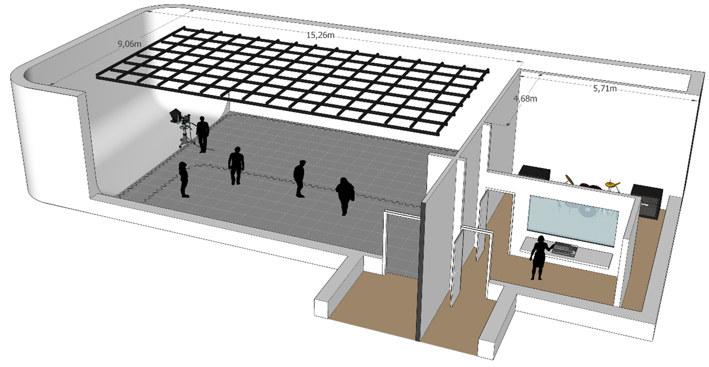

# Fiche technique des studios TIM à montmorency

## Introduction
Ce document a été rédigé par Thomas O Fredericks grâce à la précieuse contribution de Guillaume Arseneault, Xavier Martel-Lachance et William Racine.

## Description
Les studios ont été conçus en tant qu’espaces de travail et de diffusion pour des installations immersives, performances audiovisuelles, projections architecturales, diffusions sonores multicanaux et immersives, tournages vidéo et captations/retransmissions vidéo en temps réel. 

* Des portes doubles entre le Collège et les studios isolent complètement tout bruit pouvant être fait dans le grand ou le petit studio.

### Grand studio

* Le grand studio comprend un espace principal de 1500 pi² incluant un cyclorama (écran sans coins) de 300 pi². 
* Le cyclorama fait 180 degrés, occupe un mur complet (9,06 m | 30 pieds) et déborde légèrement sur deux murs adjacents (3,06 m | 10 pieds). Il est arrondi sur les côtés. 
* Dimensions totales de la salle : 15,26 ⋅ 9,06 m | 50 ⋅ 30 pieds
* Dimensions approximatives de la salle sans cyclorama : 12,2 ⋅ 9,06 m | 40 ⋅ 30 pieds.
* Dimensions approximatives du cyclorama : 3,06 x 9,06 m | 10 ⋅ 30 pieds
* Le grand studio fait environ 18 pieds | 5,48 m de haut. 
* Une herse d’accrochage (d’une capacité d’une tonne) est fixée à environ 15 pieds | 4,5 m du plancher. 
* Les tuyaux de la grille sont en noir anodisé selon le standard théâtre.
* La grille forme des carrés de 4 ⋅ 4 pieds | 1,2 ⋅ 1,2 m. 
* Une personne d’environ 5 pieds peut accrocher de l’équipement de manière sécuritaire depuis le plancher à l’aide d’un escalier mobile de 10 pieds | 3 m. 
* Sous le tapis, le sol est constitué de dalles de béton de 2 ⋅ 2 pieds | 0,6 ⋅ 0,6 m (qui peuvent être soulevées avec difficulté).
* La hauteur sous les dalles est de ½ pied | 16 cm.
* Des liaisons filaires audio, réseautiques et électriques au plancher et au plafond relient plusieurs endroits du studio avec une salle de contrôle externe. 
* Le plancher, recouvert d’un tapis, peut-être démonté pour y cacher de l’équipement.
* Puisque le sol est recouvert d’un tapis, les liquides sont interdits dans la salle.
* Les murs du grand studio sont blancs pour optimiser le contraste et la luminosité les projections.  
* Pas de prises et interrupteurs apparents sur les murs pour maximiser la surface de projection sur la totalité des murs. 
* Des rideaux noirs sur rails peuvent cacher tous les murs et même subdiviser l’espace du grand studio.

### Petit studio : studio de son et régie
Le petit studio est composé de 2 espaces isolés acoustiquement, séparés par une porte et une fenêtre : une partie studio de son de 300 pi² et une régie de 100 pi². 
* Des liaisons filaires audio, réseautiques et électriques relient plusieurs endroits du petit studio avec la salle des matrices.
* Des rideaux noirs sur rails peuvent cacher tous les murs.
* Les murs sont gris.

## Une note à propos des techniciens
Les techniciens ne sont pas des techniciens dédiés au studios. Ce sont des techniciens en travaux pratiques qui ont plusieurs mandats variés. Les techniciens peuvent donner assistance selon leurs disponibilités avec le fonctionnement de certains équipements, mais les utilisateurs de l’espace devront être autonome pour l'installation, le transport et les accrochages. 

## Plan 3D des studios

## Plan 2D des studios

